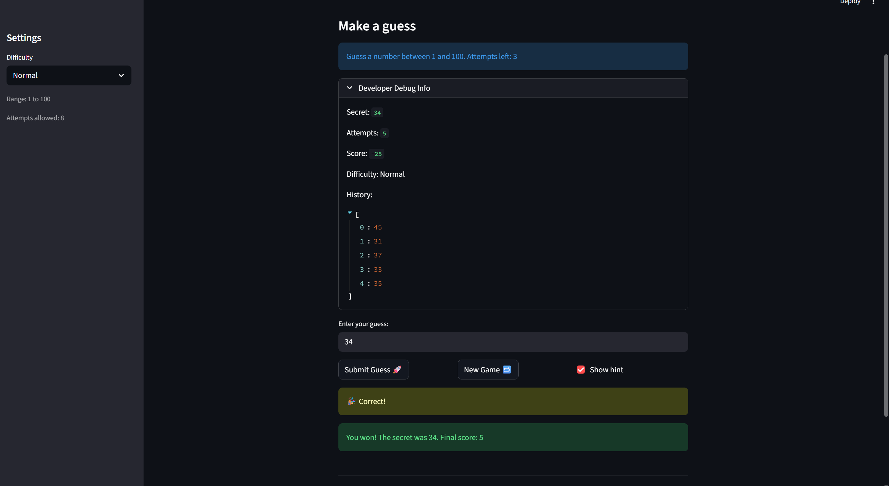

# 🎮 Game Glitch Investigator: The Impossible Guesser

## 🚨 The Situation

You asked an AI to build a simple "Number Guessing Game" using Streamlit.
It wrote the code, ran away, and now the game is unplayable. 

- You can't win.
- The hints lie to you.
- The secret number seems to have commitment issues.

## 🛠️ Setup

1. Install dependencies: `pip install -r requirements.txt`
2. Run the broken app: `python -m streamlit run app.py`

## 🕵️‍♂️ Your Mission

1. **Play the game.** Open the "Developer Debug Info" tab in the app to see the secret number. Try to win.
2. **Find the State Bug.** Why does the secret number change every time you click "Submit"? Ask ChatGPT: *"How do I keep a variable from resetting in Streamlit when I click a button?"*
3. **Fix the Logic.** The hints ("Higher/Lower") are wrong. Fix them.
4. **Refactor & Test.** - Move the logic into `logic_utils.py`.
   - Run `pytest` in your terminal.
   - Keep fixing until all tests pass!

## 📝 Document Your Experience

**Game Purpose:**
A number guessing game built with Streamlit where the player tries to guess a secret number within a limited number of attempts. The game supports three difficulty levels (Easy, Normal, Hard) with different number ranges and attempt limits. Hints guide the player after each guess.

**Bugs Found:**

1. **Backwards hint messages** — "Too High" told the player to go higher, and "Too Low" told them to go lower, making the game unwinnable by following the hints.
2. **Off-by-one attempt counter** — Attempts were initialized to `1` instead of `0`, so Normal difficulty showed 7 attempts remaining instead of 8 on the first load.
3. **History, attempts, scores not cleared on new game** — Starting a new game did not reset the score, attempt count and guess history, causing old guesses to bleed into the new session.
4. **Difficulty change did not update the secret number** — Switching difficulty (e.g. Normal → Hard) kept the old secret number, so the secret could be outside the new range. The "New Game" button also always generated a number from 1–100 regardless of difficulty.

**Fixes Applied:**

1. Swapped the hint messages in `check_guess()` so "Too High" now says "Go LOWER!" and "Too Low" says "Go HIGHER!"
2. Changed `st.session_state.attempts` initialization from `1` to `0` so attempt counts are correct from the start.
3. Added `st.session_state.history = []` and `st.session_state.score = 0` to the new game reset block so history clears properly.
4. Added `last_difficulty` tracking to session state so the secret regenerates whenever difficulty changes. Also fixed the "New Game" button to use `low, high` from the selected difficulty instead of the hardcoded range 1–100.

## 📸 Demo

## 🚀 Stretch Features

- [ ] [If you choose to complete Challenge 4, insert a screenshot of your Enhanced Game UI here]
